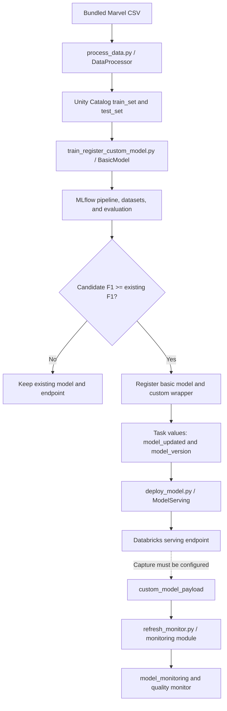

# Marvel Characters: modular MLOps on Databricks

This project uses Marvel character attributes to classify a character's recorded status as **alive or dead**. It demonstrates an MLOps lifecycle: prepare data, train and evaluate a LightGBM classifier, register models in Unity Catalog, deploy a Databricks serving endpoint, and process inference logs for monitoring.

Reusable code lives in `src/marvel_characters`. Small scripts connect those modules to Databricks Jobs; notebooks demonstrate the components interactively. Databricks bundle YAML describes packaging and orchestration.

**This is a course project with a production-oriented structure, but operational gaps remain.** A fresh environment needs an initial registered model, endpoint isolation needs fixing, and the monitoring parser does not match the custom model's output. This guide explains the implemented behaviour and the changes needed for production separately.

## Repository map

| Location | Responsibility |
| --- | --- |
| [config.py](src/marvel_characters/config.py) | Pydantic configuration and MLflow metadata tags. |
| [data_processor.py](src/marvel_characters/data_processor.py) | Cleaning, feature engineering, splitting, catalog writes, and synthetic-data helpers. |
| [models/basic_model.py](src/marvel_characters/models/basic_model.py) | Feature encoding, LightGBM training, evaluation, candidate comparison, and registration. |
| [models/custom_model.py](src/marvel_characters/models/custom_model.py) | MLflow Python model wrapping the basic pipeline to return readable labels. |
| [models/ab_model.py](src/marvel_characters/models/ab_model.py) | A/B wrapper, separate artifact staging, and wheel-backed MLflow logging. |
| [serving/model_serving.py](src/marvel_characters/serving/model_serving.py) | Creates or updates a serving endpoint for a registered model version. |
| [monitoring.py](src/marvel_characters/monitoring.py) | Parses inference payloads, writes a monitoring table, and creates or refreshes a quality monitor. |
| [utils.py](src/marvel_characters/utils.py) | Detects a Databricks runtime and retrieves the authenticated workspace host. |
| [scripts/](scripts/) | Four command-line entry points used by the bundle jobs. |
| [notebooks/](notebooks/) | Interactive course examples, including a separate A/B testing demonstration. |
| [databricks.yml](databricks.yml), [resources/](resources/) | Wheel build, targets, job environments, schedules, and task dependencies. |
| [project_config_marvel.yml](project_config_marvel.yml) | Features, target, hyperparameters, experiments, and environment-specific catalogs. |
| [pyproject.toml](pyproject.toml), [uv.lock](uv.lock), [version.txt](version.txt) | Package definition, resolved dependencies, and package version. |
| [tests/](tests/), [.github/workflows/](.github/workflows/) | Preprocessing tests and GitHub CI/CD workflows. |
| [data/](data/) | Source CSV used by preprocessing. |
| [demo_artifacts/](demo_artifacts/) | Historical MLflow demonstration metadata and an example image; these do not establish current deployment status. |

## Execution flow



Training/deployment and monitoring are separate jobs. The dotted connection requires inference logging to be configured; the serving module does not enable it. Monitoring also needs the corrections described below to process custom-model responses accurately.

Spark reads and writes catalog tables, but preprocessing uses pandas and training calls `.toPandas()` before fitting a scikit-learn pipeline. **Training is single-process, not distributed Spark training.** Both datasets must fit in the training process's memory.

## How the modules work

### Configuration

`ProjectConfig.from_yaml(path, env)` accepts `dev`, `acc`, or `prd`, selects its catalog/schema, and validates the configuration. Features, hyperparameters, and experiment paths are shared across environments.

| Target | Catalog | Schema | Bundle workspace root |
| --- | --- | --- | --- |
| `dev` | `mlops_dev` | `marvel_characters` | `/Workspace/Users/<current-user>/.bundle/dev/marvel-characters` |
| `acc` | `mlops_acc` | `marvel_characters` | `/Shared/.bundle/acc/marvel-characters` |
| `prd` | `mlops_prd` | `marvel_characters` | `/Shared/.bundle/prd/marvel-characters` |

All targets currently use the same AWS Databricks workspace. `dev` is the default and uses development mode; `acc` prefixes resource names with `acc_`; `prd` uses production mode. Developers still share the configured development tables and model names despite their separate bundle roots.

Experiments are `/Shared/marvel-characters-basic` and `/Shared/marvel-characters-custom`. `Tags` supports `git_sha`, `branch`, and optional `run_id`. The training script passes `job_run_id`, which does not match `run_id` and is ignored by the Pydantic model; that job identifier is therefore not logged through this helper.

### Data preparation: `DataProcessor`

The source is [marvel_characters_dataset.csv](data/marvel_characters_dataset.csv), attributed by the original project to the [Marvel Characters Dataset on Kaggle](https://www.kaggle.com/datasets/mohitbansal31s/marvel-characters). `Alive` describes recorded status; this is not a time-to-event survival model.

`scripts/process_data.py` reads the CSV with pandas, then calls:

1. `preprocess()` to construct model inputs, updating the processor's DataFrame.
2. `split_data()` for an 80/20 random split with seed `42`, without stratification.
3. `save_to_catalog()` to convert the splits to Spark DataFrames, add `update_timestamp_utc`, and **overwrite the data and schema** of `train_set` and `test_set` in the selected catalog/schema.

Both writes use `overwriteSchema=true` because these are fully regenerated training datasets. Without it, an existing `INT` column such as `Teams` can conflict with the `BIGINT` inferred from the new pandas data and raise `DELTA_FAILED_TO_MERGE_FIELDS` (nested cause: `IntegerType` versus `LongType`). `Alive` can have the same mismatch. Row overwrite alone does not replace the Delta schema. After changing this packaged code, redeploy the bundle to rebuild/install the wheel before repairing the failed run; repair failed tasks and their dependent tasks. Editing a workspace source file alone does not update the installed wheel.

| Column(s) | Transformation |
| --- | --- |
| `Height (m)`, `Weight (kg)` | Renamed to `Height`, `Weight`; missing numeric values are not imputed here. |
| `Universe` | Missing becomes `Unknown`; categories with fewer than 50 rows become `Other`. Frequencies are calculated before splitting. |
| `Teams` | Becomes `1` when present and `0` when missing; team names are discarded. |
| `Identity` | Missing becomes `Unknown`; rows outside `Public`, `Secret`, and `Unknown` are removed. |
| `Gender` | Missing becomes `Unknown`, then all values other than `Male`/`Female` become `Other`. |
| `Marital Status` | Renamed to `Marital_Status`; missing becomes `Unknown`, `Widow` becomes `Widowed`; only Single, Married, Widowed, Engaged, and Unknown remain. |
| `Magic`, `Mutant` | Indicators derived from the filled, original `Origin` text: `magic`, or `mutate`/`mutant`, respectively. |
| `Origin` | Ordered substring rules produce Human, Mutant, Asgardian, Alien, Symbiote, Robot, Cosmic Being, or Other. `human` is checked first. |
| `Alive` | Rows outside Alive/Dead are removed; remaining values map to `1`/`0`. |
| `PageID` | Renamed to string `Id`; retained for identification but excluded from basic-model inputs. |

YAML defines two numerical features (`Height`, `Weight`) and eight categorical features (`Universe`, `Identity`, `Gender`, `Marital_Status`, `Teams`, `Origin`, `Magic`, `Mutant`). Configured categorical columns become pandas `category`, including the binary indicators. Only these features, the target, and `Id` remain after preprocessing.

A local preprocessing check of the included CSV produced 92,560 retained rows from 92,615 source rows: 74,048 training rows and 18,512 test rows. The retained labels were 69,542 alive and 23,018 dead. Height and weight were missing in 87,249 and 87,692 retained rows respectively, so missing-data behaviour and class-level metrics deserve explicit validation. These are observations of the bundled dataset, not live catalog counts.

`enable_change_data_feed()` is available and called by the preprocessing notebook, but **the job script does not call it**. Synthetic-data helpers can generate sample distributions and introduce height/weight/gender drift; the deployed job does not use them, and their output is not a validated source of training labels.

### Training and registration: `BasicModel`

The training script executes `load_data()`, `prepare_features()`, `train()`, `log_model()`, and `model_improved()` in sequence. Registration and wrapping follow only if the comparison passes.

`load_data()` collects both catalog tables into pandas, selects configured features and target, and retrieves each Delta table's latest version for lineage logging. `Id` and timestamps are excluded from model features.

`prepare_features()` builds a scikit-learn pipeline with:

- A `ColumnTransformer`: its custom `CatToIntTransformer` learns category-to-integer mappings on the training data. Unseen categories map to `-1`; numerical columns pass through. Despite a docstring mentioning one-hot encoding, the implementation uses integer mappings.
- An `LGBMClassifier`: YAML sets `learning_rate=0.01`, `n_estimators=1000`, and `max_depth=6`. The pipeline step is named `regressor`, but it contains a classifier.

`log_model()` stores the fitted pipeline, inferred input/output signature, input example, and training/testing dataset references with Delta versions in MLflow. It evaluates the test data with MLflow's classifier evaluator and retains the resulting metrics. Hyperparameters are used for training but are not explicitly logged with `mlflow.log_params()` here.

`model_improved()` evaluates the registered basic model behind `latest-model` on the same current test set. The candidate passes if its F1 is **greater than or equal to** the incumbent's F1; ties pass. There is no minimum quality threshold or first-model fallback.

Accepted models are registered as:

```text
<catalog>.marvel_characters.marvel_character_model_basic
<catalog>.marvel_characters.marvel_character_model_custom
```

Each model receives its own `latest-model` alias. Basic and custom model version numbers are independent; the custom version is passed to deployment.

### Custom wrapper and prediction contract

`MarvelModelWrapper` is an MLflow `PythonModel`. It packages the basic pipeline as an artifact, loads it in `load_context()`, and maps predictions to readable labels. Its Python output looks like this for two illustrative predictions:

```python
{"Survival prediction": ["alive", "dead"]}
```

Inspect the actual endpoint response when implementing clients and log parsers because serving adds its own JSON envelope.

The verified HTTP response for this wrapper has the form `{"predictions": {"Survival prediction": ["alive"]}}`. Some typed CLI/SDK query clients expect an array under `predictions` and may report a decoding error despite HTTP 200. In that case, use an HTTP client or `databricks api post /serving-endpoints/<endpoint-name>/invocations --json '@request.json' --profile <profile>` to read the response without that typed decoder.

The wrapper includes the project wheel through `code_paths` and declares it as a model environment dependency. The training script constructs its path under `<root_path>/artifacts/.internal/` using the installed package version. That assumption must match the artifact location produced by deployment.

**Serving does not execute `DataProcessor.preprocess()`.** Clients must send the ten already engineered features, following the logged model signature. An example request body is:

```json
{
  "dataframe_records": [
    {
      "Height": 1.75,
      "Weight": 70.0,
      "Universe": "Earth-616",
      "Identity": "Public",
      "Gender": "Male",
      "Marital_Status": "Single",
      "Teams": 1,
      "Origin": "Human",
      "Magic": 0,
      "Mutant": 0
    }
  ]
}
```

`Teams` is an indicator, not `"Avengers"`. `Alive`, `Id`, and `update_timestamp_utc` are unnecessary for this model. For initial smoke tests, use prepared test-table records, preserve signature-compatible numeric types, and serialise missing values as JSON `null`.

### Serving: `ModelServing`

`deploy_or_update_serving_endpoint()` lists endpoints and creates or updates the matching endpoint's served entity. It accepts a numbered model version or resolves `latest-model` when passed `"latest"`. Defaults are workload size `Small` and scale-to-zero enabled.

`scripts/deploy_model.py` reads the custom model version from the training task and submits the update. It does not wait for readiness or test an invocation. Its effective endpoint name is **`marvel-character-model-serving`**: an environment-specific name is constructed and then overwritten by this constant. Fix this before deploying multiple environments to the same workspace.

### Monitoring

`create_or_refresh_monitoring()` reads all rows from `<catalog>.<schema>.custom_model_payload`. An empty table causes an early return; a missing table is not handled. It parses request/response JSON, explodes input records, and appends features, timing information, and predictions to `model_monitoring` in the same schema.

It then refreshes an existing quality monitor or creates a classification inference monitor with 30-minute aggregation windows and enables change data feed on the monitoring table. These windows are metric aggregation intervals, not the job schedule.

The parser currently expects an integer `predictions` array, uses its first entry for every record in a batch, and assigns the constant model name `marvel-characters-model-fe`. This disagrees with the custom wrapper's readable-label output. Repeated refreshes append the full history again; if every prediction parses as null, the code still retains those rows. Ground-truth labels and automatic retraining are absent.

The input columns `request_time` and `execution_duration_ms` match the gateway inference-table schema. Configure capture explicitly and verify the actual table name/schema against the [Databricks inference-table documentation](https://docs.databricks.com/aws/en/ai-gateway/inference-tables-serving-endpoints). The current parser requires correction before its results can be relied on.

## Setup and execution

### Local development

The package requires **Python 3.12**. Dependencies include MLflow `3.1.1`, LightGBM `4.6.0`, scikit-learn `1.7.0`, and Databricks SDK `0.55.0`. The development extra declares Databricks Connect `>=16.0,<17`; both bundle jobs request serverless environment client `3`.

The committed lockfile is out of sync with `pyproject.toml`: it still lists `pyspark` under the project's `test` extra, while the manifest does not. Reconcile the dependency declarations and regenerate/review `uv.lock` with `uv lock` before using the locked setup below. Avoid installing standalone PySpark alongside Databricks Connect in the same environment; use separate environments if testing against local Spark.

With that dependency reconciliation complete and `uv` installed, run from the repository root:

```shell
uv sync --locked --extra dev --extra test
uv run --extra dev --extra test pytest
uv run --extra dev --extra test pre-commit run --all-files
uv build
```

The wheel is built into `dist/`, with its version read from `version.txt` (currently `0.1.2`). Including both extras supplies Spark imports and pytest; the `test` extra alone does not declare a Spark provider. Pre-commit can modify formatting and currently excludes `scripts/` and `notebooks/`.

The job scripts are not standalone local programs: they expect deployed workspace paths, Spark access, and, for training/deployment, `dbutils.jobs.taskValues`. For remote development, configure authenticated compute and check the [Databricks Connect compatibility requirements](https://docs.databricks.com/aws/en/dev-tools/databricks-connect/requirements) against the pinned Python/Connect versions.

Authenticate a development profile using the CLI:

```shell
databricks auth login --host https://<your-workspace-host> --profile marvel-dev
```

In local MLflow code, configure tracking and Unity Catalog registration:

```python
import mlflow

mlflow.set_tracking_uri("databricks://marvel-dev")
mlflow.set_registry_uri("databricks-uc://marvel-dev")
```

Configure `WorkspaceClient` and Connect with the same profile, for example using `DATABRICKS_CONFIG_PROFILE=marvel-dev` in your shell. Some notebooks separately read `PROFILE`, `DBR_HOST`, and `DBR_TOKEN` from an ignored `.env`; these are notebook conventions, not settings loaded by every module. Deployed scripts rely on runtime authentication and MLflow defaults, which should be verified for the target workspace.

### Databricks prerequisites and first run

Prepare these before executing the workflow:

- A Unity Catalog workspace with suitable serverless job compute and custom model serving available.
- The configured catalogs and `marvel_characters` schemas; the bundle does not create them.
- An execution identity with access to workspace files/experiments, training tables, model registration, and endpoint management. Serving and monitoring identities also need access to their corresponding models, tables, and output locations.
- Workspace hosts and catalog names adapted in the YAML files.
- An initial basic model under `latest-model`, or a code change explicitly handling an absent incumbent.

For a course bootstrap, run the preprocessing notebook, then the basic-model notebook's load/prepare/train/log/register steps. Those registration steps do not call `model_improved()` and can establish the first alias. Select cells deliberately: the MLflow notebooks include demonstrations of expected errors and unsupported operations. Automated deployments should instead implement and test a first-run branch.

### Bundle deployment and job execution

The bundle builds the wheel with `uv build`, installs `../dist/*.whl` in job environments, and passes `--root_path` and `--env` to scripts. Scripts read configuration and source data under `<root_path>/files/`.

After adapting the configuration and addressing the relevant execution gaps:

```shell
databricks bundle validate -t dev --profile marvel-dev
databricks bundle deploy -t dev --profile marvel-dev --var="git_sha=<commit-sha>,branch=<branch-name>"
databricks bundle run -t dev --profile marvel-dev deployment
```

Replace placeholders with the deployed source revision. Validation, deployment, and execution are separate operations in the [bundle CLI](https://docs.databricks.com/aws/en/dev-tools/cli/bundle-commands). **Deploying a bundle does not itself train a model or update the endpoint**; those actions occur when its job runs.

The [training/deployment job](resources/model_deployment.yml) contains:

| Task key | Entry point/action | Dependency and result |
| --- | --- | --- |
| `preprocessing` | `scripts/process_data.py` | Overwrites the environment's train/test tables. |
| `train_model` | `scripts/train_register_custom_model.py` | Runs after preprocessing; trains, compares, and conditionally registers. Sets `model_updated=1` plus `model_version` when accepted, otherwise `model_updated=0`. |
| `model_updated` | Condition task | Checks whether the training task's `model_updated` value equals `1`. |
| `deploy_model` | `scripts/deploy_model.py` | Runs on the condition's true outcome and deploys the custom version passed by training. |

Training also receives `--git_sha`, `--branch`, and `--job_run_id`. The [monitoring job](resources/bundle_monitoring.yml) has one task, `refresh_monitor_table`, invoking `scripts/refresh_monitor.py`. After capture/parsing are working and requests have been logged, run it separately:

```shell
databricks bundle run -t dev --profile marvel-dev marvel-characters-monitor-update
```

Both jobs specify Monday at 06:00 in `Europe/Amsterdam`. **All targets set schedules to `PAUSED`, including production.** The jobs have no dependency on each other; identical schedule times do not guarantee monitoring data is ready.

### Recovering a wrapper logged on Windows

MLflow `3.1.1` can store a Windows separator in a Python model's artifact metadata, such as `artifacts\.`. In a Linux serving container this can become `/model/artifacts\.` and fail during `load_context()`. The artifact key `lightgbm-pipeline` does not necessarily imply a directory with that name: the correct directory may simply be `/model/artifacts`.

Package `0.1.1` normalises these separators and verifies that the resolved directory contains `MLmodel` before loading the pipeline. It also handles Windows wheel paths when creating model environment dependencies. Existing registered versions retain their original packaged code; changing the source file does not repair them in place.

To recover, build/install the updated wheel, restart the notebook Python session to remove the old imported wrapper, and re-run the custom-model notebook with the new wheel in `code_paths`. Reuse the existing trained basic model; retraining is unnecessary for this packaging fix. Register a new custom version, deploy that explicit version, wait for readiness, and smoke-test it. Do not rely on the training workflow's quality gate to perform a packaging-only repair.

The regression tests cover Linux-style resolution of Windows artifact metadata, missing model files, and real MLflow save/load plus batch prediction. They can also run without pytest using `python -m unittest tests.marvel_characters.test_custom_model -v` in an environment containing the project dependencies.

### Portable A/B model packaging

Starting with package `0.1.2`, the A/B notebook imports `log_ab_model()` from `models/ab_model.py` instead of defining an independent wrapper in a notebook cell. `MarvelABModelWrapper` shares the custom model's portable artifact loader, preserving the same odd/even MD5 routing and single-record response shape (`Prediction` and `model`). The existing first-row routing/first-prediction batch limitation still applies.

`stage_ab_artifacts()` downloads each classifier into a separate temporary directory and stages it as `model_A` or `model_B` before logging. This prevents two downloads named `artifacts` (or returned at the download root) from sharing the same packaged path. The failed original A/B artifact referenced `artifacts\.` for both model keys; replacing separators alone would not ensure two distinct pipelines.

The notebook uses numbered source-model versions, logs the source URIs as metadata, includes the current project wheel in the serving dependencies, and registers the URI returned by MLflow. Re-running deployment updates the existing A/B endpoint. Requests use SDK authentication headers on each call and stop on HTTP errors.

To repair a previously logged A/B model without retraining, reuse the original numbered basic-model versions, build/install the latest wheel, and call `log_ab_model()` in an MLflow run with those URIs, a prepared single-row input containing `Id`, and the wheel path. Register the returned `model_uri` and update the endpoint to that new version. Verify both an odd-hash ID and an even-hash ID. Run both regression suites with `python -m unittest tests.marvel_characters.test_custom_model tests.marvel_characters.test_ab_model -v`.

### Notebook guide

| Notebook | Demonstration |
| --- | --- |
| `lecture2.marvel_data_preprocessing.py` | Calls `DataProcessor` and enables table change data feed. |
| `lecture3.mlflow_experiment_tracking.py` | Experiments, runs, tags, metrics, artifacts, searches, and nested runs. |
| `lecture4.train_register_basic_model.py` | Trains/registers the basic model and inspects model/data lineage. |
| `lecture4.train_register_custom_model.py` | Registers a wrapper around an existing basic model and loads it for inference. |
| `lecture6.deploy_model_serving_endpoint.py` | Deploys a model and sends example requests. |
| `lecture6.ab_testing.py` | Trains two models and routes by a hash of `Id` in a separate wrapper/endpoint. It uses the first record for routing and returns only the first prediction, so it is a single-record demonstration. |
| `lecture10.marvel_create_monitoring_table.py` | Generates serving traffic and invokes the monitoring module. |

Notebook wheel names/versions and endpoint names are not fully consistent with the packaged workflow. For example, the monitoring notebook uses plural `marvel-characters-model-serving`, whereas the deployment script uses singular `marvel-character-model-serving`. Update references before running cells. Request loops generate repeated live endpoint traffic; they are demonstrations rather than automated acceptance tests.

## Productionalisation in practice

The module/script/bundle separation is a useful foundation. Production operation needs reproducible inputs and artifacts, explicit environment boundaries, and evidence that serving and monitoring work before declaring a release successful.

### Implementation gaps to close

| Area | Current behaviour | Production change |
| --- | --- | --- |
| First model | Comparison requires an existing alias. | Handle the specific missing-model/alias case, apply minimum acceptance criteria, and surface other failures. |
| Isolation | Endpoint name is constant; experiments and development data are shared. | Keep environment-specific endpoints, scope experiments/development data, and configure access boundaries. |
| Feature consistency | Raw feature engineering is outside the served artifact; universe frequencies use the full dataset. | Version/reuse fitted transformations for training and inference, learning statistical rules on training data only. |
| Evaluation | Random holdout is reused for promotion; equal F1 passes. | Add baselines, minimum quality/regression limits, class-level metrics, and independent final evaluation. Consider grouping related character variants to reduce leakage. |
| Lineage | Job tag is mismatched, parameters are not explicitly logged, and data reads/version lookups are separate. | Correct tags, log configuration and wheel identity, and read pinned Delta versions so lineage matches the data actually used. |
| Packaging | Wrapper assumes an internal wheel path; some imports depend on the runtime. | Resolve the deployed artifact reliably and test loading/predicting in a clean serving environment. Audit direct imports including YAML, Spark, Delta, and Connect. |
| Dependency reproducibility | `uv.lock` still declares a test PySpark dependency absent from `pyproject.toml`. | Reconcile and commit both files together, separate local Spark from Connect environments, and enforce locked installs in CI. |
| Endpoint health | Create/update is submitted without waiting or scoring. | Wait with a timeout, inspect failures, and smoke-test the exact served version. |
| Capture | Payload table is assumed to exist. | Configure capture, parameterise its actual table name, and validate its schema. |
| Log processing | Wrong prediction shape, first prediction reused for batches, full-history appends, constant model name. | Parse the actual wrapper output, pair by record position, process incrementally, deduplicate by request ID/record index, and retain the served model version. |
| Monitoring quality | Ground truth is absent; malformed predictions can remain null. | Quarantine malformed/error payloads, join delayed labels using stable IDs, and alert on quality, drift, latency, errors, and missing logs. |
| Runtime and scale | Data is collected to pandas; monitoring imports Connect without requesting the `dev` extra in its job dependency. | Verify runtime imports, use the appropriate in-job Spark session, and define memory limits/scaling strategy. |
| Scheduling | Both schedules are paused and independent. | Set data-readiness conditions, appropriate frequencies, owners, and failure handling before enabling schedules. |

### Current CI/CD and its limitations

[CI](.github/workflows/ci.yml) runs on pull requests to `main`: it installs the `test` extra, runs pre-commit, and runs pytest. Tests cover preprocessing and synthetic-data helpers. The catalog-write test mocks `save_to_catalog()` itself, so it does not validate an actual write. Model training, serving, and monitoring lack integration coverage. CI also omits the Spark provider required during test imports.

[CD](.github/workflows/cd.yml) runs on pushes to `main` or manual dispatch. Its `acc`/`prd` matrix uses GitHub environment configuration (`DATABRICKS_HOST`, `DATABRICKS_CLIENT_ID`, `DATABRICKS_CLIENT_SECRET`) and CLI `0.246.0`. It deploys job definitions but does not execute training. The YAML does not enforce acceptance-before-production ordering or depend on successful CI; any external branch/environment protection is outside this repository.

Both workflows print `VERSION=...` with `echo`, then use `$VERSION` without assigning it. Their intended release tag is therefore not populated by those lines. Correct the assignment, handle existing tags, use explicit deployment targets, and validate before deployment. Production also needs explicit ownership/run-as/permission configuration appropriate to the workspace.

### A practical release and operating procedure

1. **Develop and test.** Change reusable code on a branch. Run formatting and meaningful tests for feature contracts, model serialisation, first-run promotion, and batched log parsing. Build a uniquely versioned wheel tied to the commit.
2. **Validate in acceptance.** Deploy the release to `acc`, test against isolated tables, train/evaluate a candidate, and verify its registered custom model and endpoint. Confirm captured requests produce one correctly matched monitoring row per scored record.
3. **Approve and promote.** Record accepted metrics and artifact identity. Use a sequential production gate. If copying models across catalogs, track the destination version explicitly. If retraining on production data, evaluate that result as a new candidate.
4. **Release serving.** Deploy the exact accepted custom version, wait for readiness, and check the prediction contract and latency. Add controlled traffic rollout where required; the course A/B notebook is not a production rollout mechanism.
5. **Operate.** Use a service principal for deployment and job execution, with scoped environment access, as recommended in the [Databricks CI/CD guidance](https://docs.databricks.com/aws/en/dev-tools/ci-cd). Set ownership, failure notifications, timeouts, retries, concurrency limits, retention, and schedules based on data arrival and detection needs.
6. **Recover.** Record the previous serving version and endpoint configuration. Roll back by redeploying that explicit version through `ModelServing.deploy_or_update_serving_endpoint(version="<previous-version>")`, waiting for readiness, and checking predictions. Changing `latest-model` alone does not update an endpoint pinned to a numbered version. Restore the previous code/configuration release separately if required.

For example, after a Monday source-data update, preprocessing would validate and snapshot the new data, then training would compare a candidate with the incumbent. An accepted candidate would proceed through serving checks; a rejected candidate would leave the endpoint unchanged. Inference logs would be processed incrementally and joined to later labels for performance measurement. Alerts would trigger investigation or a governed retraining workflow, rather than automatically replacing the model whenever a feature distribution changes.

These corrective changes, release gates, alerts, and rollback automation describe the production extension. They are not implemented by this README or the current bundle.
